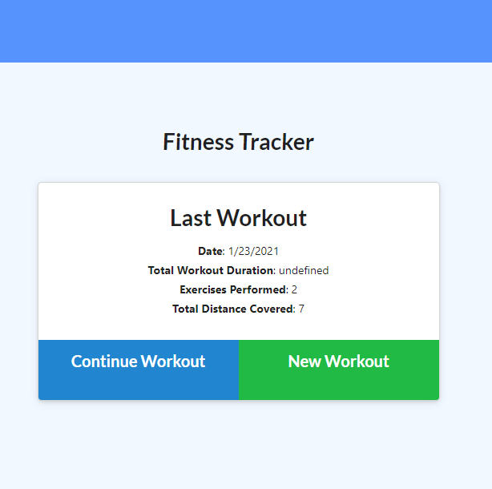

# 17_fitness_tracker

## License
   
  

  ## Description

This is an application that utilizes NoSQL Database software to store workout information on a backend server. Information can be read and store to the Database when given values into a front end input field.

## Usage

To use this app go to the deployed heroku site below. You can enter any amount of workout information with time intervals. When workouts are done hit "Complete workout". Once completed data will be diplayed on graphs in the dashboard page with the corresponding information.

  ## Link

  Heroku: https://fitness-tracker1738.herokuapp.com/?id=600ce9d9b7b77e0015a7c0c2

  ## Images

 ## Questions

 [github.com/sethglenn](https://github.com/sethglenn)

 Contact me at my github profile above for any inquiries you may have.